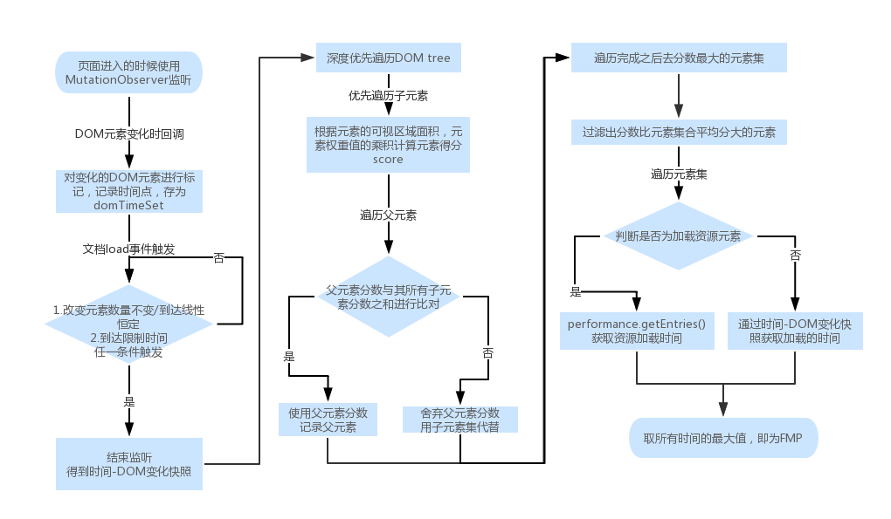

<!--
 * @Author: your name
 * @Date: 2019-12-17 15:56:46
 * @LastEditTime: 2019-12-17 15:58:10
 * @LastEditors: Please set LastEditors
 * @Description: In User Settings Edit
 * @FilePath: \EVO\owl-sdk\md\fmp.md
 -->
 ## FMP
1. 深度遍历监听dom变更，为dom元素进行标记，记录变更时间（performance.now()) 
2. （页面加载完成）停止监听以后，计算所有dom及其子元素的得分状况
3. 得分规则：“width * height * weight（Dom类型权重） * 元素在首屏的面积占比"（元素位于首屏权重高）
4. 最后将元素的子元素得分之和与其得分进行比较，取大值，记录得分元素集合（可视区域内得分最高的元素）
5. 取所有元素最大的加载时间 作为页面FMP时间

