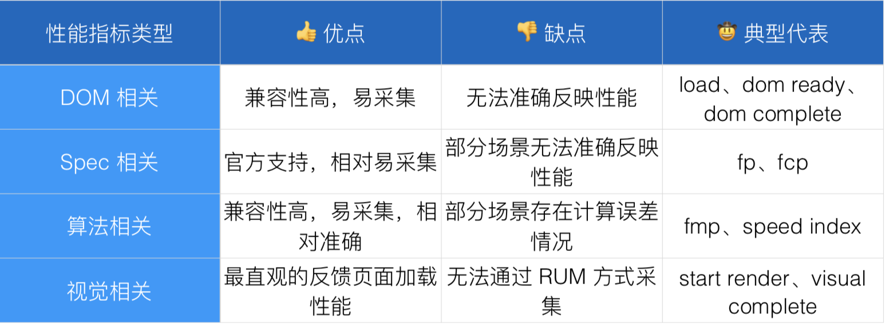

<!--
 * @Author: your name
 * @Date: 2019-12-17 14:16:29
 * @LastEditTime: 2019-12-17 14:45:03
 * @LastEditors: Please set LastEditors
 * @Description: In User Settings Edit
 * @FilePath: \EVO\咕噜咕噜\前端性能指标.MD
 -->
## 浏览器指标

- 使用标准的 API；
- 定义合适的指标；
- 采集正确的数据；
- 上报关联的维度。

### 首次渲染时长（First Paint） 首次内容渲染时长（First Contentful Paint）

    这两个指标相比于页面加载时长它更聚焦于页面元素的渲染，相对来说更客观，但同时可以看到，页面上有象素被渲染出来，并不一定代表着用户去看到了**它关心的主要内容**，在实际的经验中也可以看到，大多数时候，这两个指标的相差并不是特别大。

    那么页面加载时长会有异常情况，First Paint 和 First Contentful Paint 又会有各种差异不大，或者是不能够完全代表这个页面性能的情况； 

优点：
- 原生 API；

- 接受度高；

- 感知明显（浏览器 Tab 停止 loading）。

缺点：

- 无法准确反映页面加载性能；

- 易受特殊情况影响。

### 首次有效渲染时长（First Meaningful Paint） 

     First Meaningful Paint，首次有效渲染时长，这个指标最早是由 Google 提出的，它的一个核心的想法是渲染并不一定代表着用户看到了主要内容，Load 也不一定代表用户看到主要内容，那用户什么时候能够看到主要内容呢？我们假设当一个网页的 DOM 结构发生剧烈的变化的时候，就是这个网页主要内容出现的时候，那么在这样的一个时间点上，就是用户看到主要内容的一个时间点。

     它的优点是相对校准的估算出内容渲染时间，贴近用户感知。但缺点是无原生 API 支持，算法推导时 DOM 节点不含权重。

